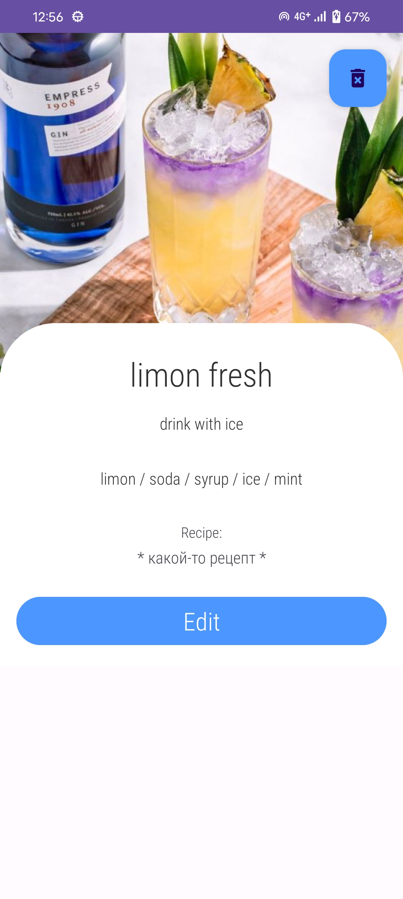

# Функционал
### Не получилось:
- Ингредиенты
- Некоторые элементы дизайна

### Не успела, но планировала:
- Основная логика приложения
- Загрузка и сохранение фотографий
- Возможность делиться рецептами

### Что есть в итоге:
- Структура проекта
- Реализованы классы, связанные с бд, di и mvvm
- Дизайн фрагментов
- Граф навигации
- Адаптер для списка коктейлей
- Контейнер для FAB

# Технические детали реализации
* Room
* Single Activity
* MVVM
* Hilt
* Navigation Components
* Glide
* Coroutines
* DiffUtil

# Скриншоты

